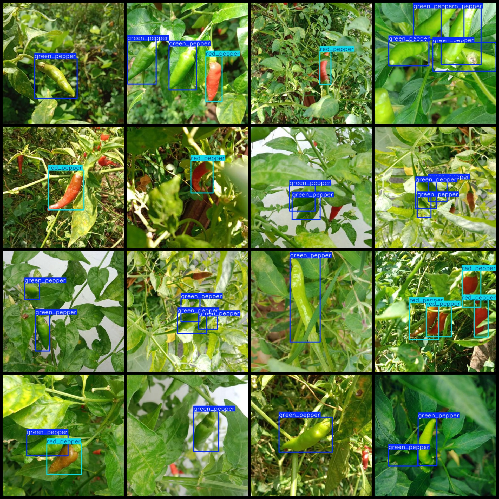
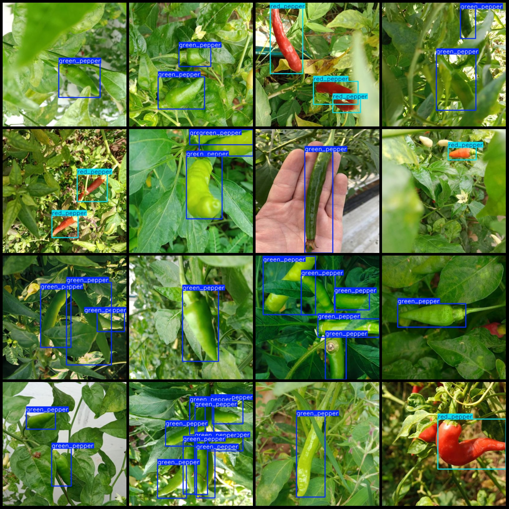

# Wisdom Agriculture Pepper Color Gradient Jiaozhi Green Red Gradient Detection Data Set VOC+YOLO Format 1475 Images in 2 Categories

Dataset Format: Pascal VOC format + YOLO format (txt file without split path, only containing jpg images and corresponding VOC format xml files and yolo format txt files)
Number of Images (jpg file count): 1475
Number of Annotated Items (xml file count): 1475
Number of Annotated Items (txt file count): 1475
Number of Annotated Categories: 2
Labeling Categories Name (note that the order of categories in the yolo format is not consistent with this, but it should be based on the labels folder classes.txt): ["green_pepper", "red_pepper"]
Number of Boxes per Category:
green_pepper (Green pepper) boxes = 2228
red_pepper (Red pepper) boxes = 708
Total Boxes = 3936
Image Resolution: 416x416
Annotation Tool Used: labelImg
Annotation Rules: Draw bounding boxes for each category
Important Notice: The dataset does not have a division into training, validation, or test sets; you need to divide it yourself.
Special Remark: This dataset does not guarantee the accuracy of the models trained or the weight files used.
Image Preview:
Annotation Example:

## Images

Here is a pay link on Stripe ( https://buy.stripe.com/3cs8yP7sY87d0vu9AB ). Please contact me lonlonago@foxmail.com after funding $89, and I will send you a complete data files , thank you!

